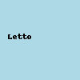
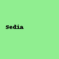

# forum-designer<!DOCTYPE html>
<html lang="it">
<head>
  <meta charset="UTF-8" />
  <meta name="viewport" content="width=device-width, initial-scale=1.0" />
  <title>Room Designer</title>
  <link rel="stylesheet" href="style.css" />
</head>
<body>
  

    <h2>Catalogo</h2>
    
    
  

  

    

  

  
</body>
</html>
body {
  margin: 0;
  overflow: hidden;
  font-family: sans-serif;
  display: flex;
  height: 100vh;
}

#catalog {
  width: 150px;
  background-color: #f0f0f0;
  padding: 10px;
  box-sizing: border-box;
  border-right: 1px solid #ccc;
}

#catalog h2 {
  font-size: 16px;
  margin-bottom: 10px;
}

.catalog-item {
  width: 100px;
  margin-bottom: 10px;
  cursor: grab;
}

#room-container {
  flex-grow: 1;
  overflow: hidden;
  position: relative;
  background-color: #dcefff;
}

#room {
  width: 3000px;
  height: 100vh;
  position: relative;
  background-image: url('stanza-sfondo.png');
  background-repeat: repeat-x;
  background-size: cover;
  cursor: grab;
}
.furniture {
  position: absolute;
  width: 100px;
  user-select: none;
}const room = document.getElementById('room');
let isDraggingRoom = false;
let startX;
let scrollLeft = 0;

// Scorrimento laterale della stanza
room.addEventListener('mousedown', (e) => {
  isDraggingRoom = true;
  startX = e.pageX - scrollLeft;
});
document.addEventListener('mouseup', () => isDraggingRoom = false);
document.addEventListener('mousemove', (e) => {
  if (!isDraggingRoom) return;
  scrollLeft = e.pageX - startX;
  room.style.transform = `translateX(${scrollLeft}px)`;
});

// Mobile touch
room.addEventListener('touchstart', (e) => {
  isDraggingRoom = true;
  startX = e.touches[0].pageX - scrollLeft;
});
room.addEventListener('touchend', () => isDraggingRoom = false);
room.addEventListener('touchmove', (e) => {
  if (!isDraggingRoom) return;
  scrollLeft = e.touches[0].pageX - startX;
  room.style.transform = `translateX(${scrollLeft}px)`;
});

// Trascinamento mobili dal catalogo
document.querySelectorAll('.catalog-item').forEach(item => {
  item.addEventListener('dragstart', (e) => {
    e.dataTransfer.setData('type', e.target.dataset.type);
    e.dataTransfer.setDragImage(e.target, 50, 50);
  });
});

room.addEventListener('dragover', (e) => e.preventDefault());

room.addEventListener('drop', (e) => {
  e.preventDefault();
  const type = e.dataTransfer.getData('type');
  const img = document.createElement('img');
  img.src = `${type}.png`;
  img.className = 'furniture';
  img.style.left = (e.pageX - room.getBoundingClientRect().left) + 'px';
  img.style.top = (e.pageY - room.getBoundingClientRect().top) + 'px';
  room.appendChild(img);
});
